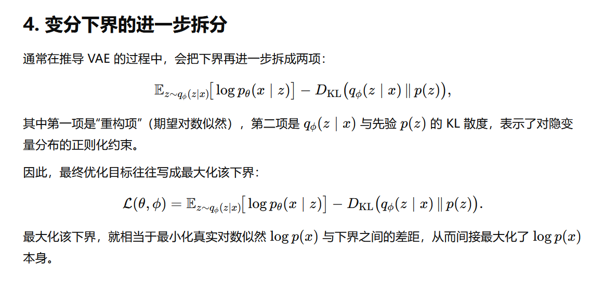
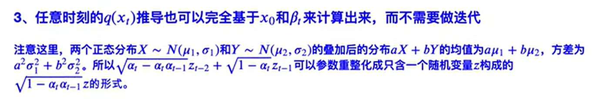
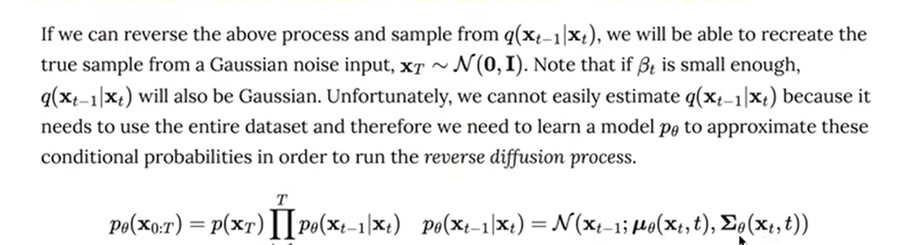
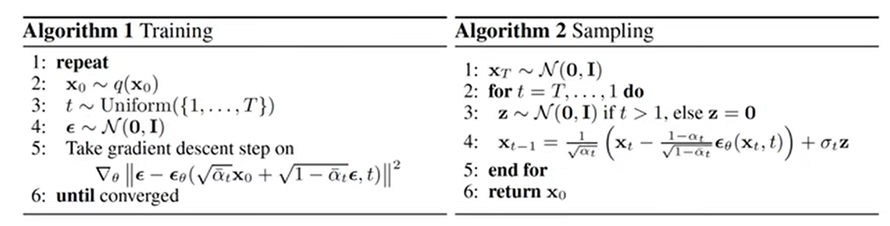
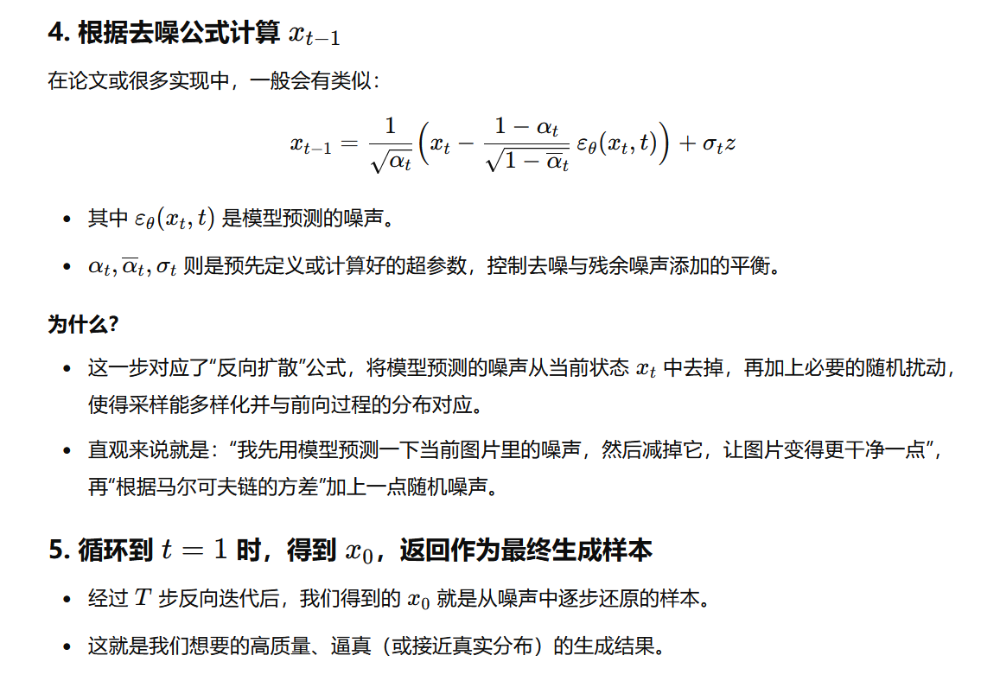

# White Box

# Abstract[1]

这项研究是一个全面的、实用的指南，用于使用“白盒”方法从零开始构建大型模型。

针对对深度学习有基本了解的读者，它将整个模型构建管道精心分解为关键组件，

如**Qwen，Diffusion, Agent, Evaluation， LLM， RAG和Transformer Models**。

通过详细的技术解释和完整的代码实现，该指南使用户能够独立地再现和理解每个核心元素，最终为构建他们自己的大型模型提供可再现的和实用的框架\cite{tiny-universe}。

关键词-大型模型，白盒人工智能，实践深度学习，模型训练，RAG框架，Agent系统，模型评估，变压器，扩散模型，人工智能再现性。


# 1.Qwen[2]

Qwen（通义千问）是阿里巴巴开发的大型语言模型（LLM），用于理解和生成类似人类的文本。 

Qwen包含具有不同参数计数的不同模型。

它包括Qwen（基础预训练语言模型）和Qwen- chat（使用人类对齐技术进行微调的聊天模型）。

基本语言模型在众多下游任务中始终表现出卓越的性能，而聊天模型，特别是那些使用人类反馈强化学习（RLHF）训练的模型，具有用于创建代理应用程序的高级工具使用和规划功能。

此外，Qwen有专门的编码模型Code-Qwen和Code-Qwen- chat，以及基于基本语言模型的数学模型Math-Qwen-Chat。

与开源模型相比，这些模型表现出了显著的性能改进，并且略微落后于专有模型。


# 2.Diffusion

## 2.1介绍

**Diffusion模型**（扩散模型）在**机器学习和计算机视觉**领域中尤为热门，特别是在**生成式人工智能（Generative AI）**方面。

扩散模型是一类**概率生成模型**，用于逐步去噪（denoising）随机噪声，从而生成高质量的样本，如图像、音频或文本。其核心思想借鉴了物理学中的扩散过程——即分子从高浓度区域扩散到低浓度区域的自然过程。

扩散模型主要包括**两个阶段**。

**正向扩散过程（Forward Process）**：从一个真实样本（如一张图片）开始，逐步向其添加高斯噪声，直到最终变成**纯随机噪声**。这个过程是一个**马尔可夫链（Markov Chain）**，类似于数据的“破坏”。

**反向去噪过程（Reverse Process）**：训练一个神经网络（通常是U-Net），学习如何逐步去噪，并最终从纯噪声恢复出高质量的样本。这类似于数据的“重建”。该过程通常使用**变分推理（Variational Inference）**或**斯特拉托诺维奇方程（Stratonovich Equation）**进行建模。

近年来，Diffusion模型的进步带来了许多令人惊艳的AI生成模型，主要包括：

DDPM（Denoising Diffusion Probabilistic Models）：由Google Brain团队提出，奠定了现代扩散模型的基础。

DDIM（Denoising Diffusion Implicit Models）：通过减少采样步骤，加速了生成过程。

Stable Diffusion：由Stability AI开源的扩散模型，能够生成高质量图像，广泛用于AI艺术生成领域。

Imagen & DALL·E 2：Google的Imagen和OpenAI的DALL·E 2，基于扩散模型进行文本到图像（Text-to-Image）生成。

 **Diffusion模型的优势**

✅ **生成质量高**：能够生成极其真实的图像和数据。
✅ **稳定性强**：相比GAN（生成对抗网络），不会出现模式崩溃（Mode Collapse）。
✅ **训练更稳定**：避免了GAN的难训练问题，使用简单的均方误差（MSE）损失即可优化。

 **Diffusion模型的挑战**

⚠ **计算资源需求高**：生成速度慢，训练需要大量计算资源。
⚠ **采样步骤多**：通常需要数百步去噪，使得推理过程较慢。
⚠ **优化难度较高**：需要精心设计的网络架构，如U-Net和Transformer结构。

 **Diffusion的应用**

扩散模型已经广泛应用于多个领域：

- **图像生成**（如Stable Diffusion、DALL·E 2）
- **文本到图像（Text-to-Image）**（如Imagen）
- **视频生成**（如Runway Gen-2）
- **音乐生成**（如Riffusion）
- **医学影像合成**（如MRI、CT影像生成）

Diffusion模型是一种强大的生成模型，通过模拟噪声的扩散与去噪过程，可以生成高质量的数据。

虽然计算成本较高，但其稳定性和生成质量使其成为当前**生成式AI**领域的主流技术之一。

随着研究的不断深入，未来Diffusion模型可能会在**生成速度优化、计算成本降低**等方面取得进一步突破。 


## 2.2去噪扩散概率模型[3]

我们展示了使用扩散概率模型进行高质量图像合成的结果，

这是一种受**非平衡热力学**考虑启发的潜在变量模型。

我们通过在根据扩散概率模型与 Langevin  动力学下的去噪得分匹配之间的新颖联系设计的加权变分界面上进行训练，获得了最佳结果，

并且我们的模型自然地接受了一种可以解释为自回归解码泛化的渐进式有损解压缩方案。

在无条件的 CIFAR10 数据集上，我们获得了 9.46 的 **Inception 分数**和 3.17 的创纪录 FID 分数。

在 256x256 LSUN 上，我们获得了与 ProgressiveGAN 相似的样本质量。

我们的实现可在  https://github.com/hojonathanho/diffusion 上找到。


深度生成模型在各种数据模态中最近展示了高质量样本。

生成对抗网络（GANs）、自回归模型、流和变分自编码器（VAEs）

合成了引人注目的图像和音频样本，

在基于能量的建模和得分匹配方面取得了显著进展，产生了与 GANs 相当图像。

本文介绍了扩散概率模型[53]的进展。


扩散概率模型（为了简便，我们将称之为“扩散模型”）是一个参数化的马尔可夫链，

通过变分推理训练，

在有限时间内产生与数据匹配的样本。


该链的转换是通过学习来逆转扩散过程，这是一个马尔可夫链，它逐渐向数据中添加噪声，直到信号被破坏。

当扩散由少量高斯噪声组成时，将采样链的转换设置为条件高斯也是足够的，这允许特别简单的神经网络参数化。


扩散模型易于定义且训练高效，但据我们所知，尚未有证据表明它们能够生成高质量的样本。

我们表明，扩散模型实际上能够生成高质量的样本，有时甚至优于其他类型生成模型的已发布结果。

此外，我们表明，扩散模型的一种特定参数化在训练过程中与多个噪声水平下的去噪评分匹配等效，

在采样过程中与退火朗之万动力学等效。

我们使用这种参数化获得了最佳的样本质量结果，因此我们认为这种等效性是我们的一项主要贡献。


尽管我们的模型具有样本质量，但与其他基于似然的模型相比，

我们的模型没有有竞争力的对数似然

（然而，我们的模型确实具有比据报道为基于能量的模型和分数匹配产生的大估计退火重要性抽样更好的对数似然 [[11](https://ar5iv.labs.arxiv.org/html/2006.11239?_immersive_translate_auto_translate=1#bib.bib11)， [55](https://ar5iv.labs.arxiv.org/html/2006.11239?_immersive_translate_auto_translate=1#bib.bib55)]）。


我们发现，我们模型的大部分无损代码长度都被用来描述难以察觉的图像细节（[第 4.3 节 ](https://ar5iv.labs.arxiv.org/html/2006.11239?_immersive_translate_auto_translate=1#S4.SS3)）。

我们用有损压缩的语言对这种现象进行了更精细的分析，我们表明扩散模型的采样过程是一种渐进式解码，

类似于沿位排序的自回归解码，它极大地概括了自回归模型通常可能的情况。


## 2.3数学基础[4]

### 2.3.1 条件概率的一般形式


公式1

A和B和C同时发生的概率

 = B和A同时发生的情况下，C发生的概率

= A发生的情况下,B 发生的情况下，C发生的概率

公式2

即在事件 A已发生的前提下，B和 C 同时发生的概率，

可以先看“给定 A 时 B发生”的概率，再乘以“在 A 和 B 都已发生时 C 发生”的概率。

### 2.3.2 基于马尔可夫假设的条件概率


核心思想： 给定中间状态就屏蔽了对前面状态的依赖 (无记忆性)

就是当我们知道 B 的取值后，C与 A就变得独立（不再依赖于 A的取值）

马尔科夫链的性质 P(C∣B,A)=P(C∣B)


### 2.3.3 高斯分布的KL散度公式

对于两个单一变量的高斯分布p和g而言，它们的KL散度为


Kullback–Leibler 散度（KL 散度）是用来衡量两个概率分布 p 和 q之间差异的一个非对称度量，定义为


对于离散分布时是求和形式，对于连续分布时是积分形式。

KL 散度反映的是在“假设数据来自 **p 分布**”的前提下，用**分布 q**来**解释**这些数据所产生的**信息损失**。

它不是对称的，也不满足三角不等式，因此不是真正意义上的距离，但在信息论和统计学中有非常重要的应用。


当 p和 q都是**一维正态（高斯）分布**时，我们可以把它们的概率密度函数分别写为


根据 KL 散度的定义，我们需要计算


把高斯分布的形式代入后，会出现指数和对数项，通过展开和化简最终可以得到一个闭式解。

这个过程在很多统计学和机器学习教材中都有详细推导，最后得到的结果就是题目中所列出的公式。


直观理解


### 2.3.4 参数重整化

从 N(μ,σ2)N(\mu, \sigma^2) 中采样的常见做法

如果我们想要从一个正态分布 X∼N(μ,σ2)中获得随机样本，一种常见做法是：

先从标准正态分布 u∼N(0,1)中采样。

再将 u进行线性变换得到 X=σ⋅u+μ.

这样，X 就服从 N(μ,σ2)

这是因为对于标准正态随机变量 u，其分布为 N(0,1)

经过线性变换后，σu会变成均值 0、方差 σ^2的分布，再加上 μ 则将分布平移到均值 μ 上。

------

2. 这样做的好处（重参数化的思路）

在深度学习（特别是变分自编码器 VAE）或者其他需要**对随机采样过程进行梯度回传**的场景中，

我们常会使用这种“重参数化”（Reparameterization）方法。好处包括：

1. **可微性**

   直接从 N(μ,σ2)采样时，μ 和 σ 都在采样公式里，如果你想要对 μ 或 σ 做梯度更新，

   采样操作本身并不易直接求导（采样过程是随机的）。

   重参数化后，在求对 μ,σ的梯度时，我们可以把随机性“隔离”在 z 上，而将 μ,σ当作网络或模型的参数。

   这就使得梯度能更容易地通过这条公式回传到 μ,σ 上。

2. **更容易在神经网络中实现**

   在实际代码中，很多框架都有从标准正态分布采样的现成操作。

   然后通过这条简单的线性公式，可以生成具有任意均值、方差的正态分布随机变量。

   在训练中，如果 μ 和 σ 是网络输出的参数，借助自动微分框架，这种分解会让梯度计算顺畅进行。

3. **分布迁移的直观理解**

   可以将标准正态 N(0,1)N(0,1) 理解为“基准随机噪声”，而 μ和 σ则是对该噪声进行“拉伸”和“平移”的控制参数。

   这样做在概念和实现上都更灵活：我们只需要维护一个标准正态随机源，就能通过不同的 μ和 σ生成各种分布。

------

3.总结

先从标准正态采样、再转换到目标正态分布

将随机性（噪声）与参数（μ,σ）分离，既保持了对目标分布的准确采样，

又在需要训练/调优参数时，便于梯度回传（可微），这就是重参数化的关键思想。


## 2.4  单层VAE的原理公式与置信下界


变分推断（Variational Inference）的典型推导过程，

变分自编码器（VAE）的推导里。

它们说明了如何从对数似然出发，引入一个辅助分布（即变分分布）来近似难以直接求解的后验分布，

从而得到一个可优化的下界（Evidence Lower BOund，ELBO）。

把难以直接优化的 log⁡p(x) 转换成一个可以用随机梯度方法优化的下界。

通过采样 z来近似期望，再利用反向传播更新 θ和 ϕ就能学到生成模型以及隐变量的分布。




## 2.5 扩散模型


### 2.5.1 扩散过程

1.给定初始数据分布xo ~ q(x)，可以不断地向分布中添加高斯噪声，

该噪声的标准差是以固定值βt而确定的，

均值是以固定值,,和当前t时刻的数据xt决定的。这个过程是一个马尔科夫链过程。

2、随着t的不断增大，最终数据分布xT变成了一个各向独立的高斯分布，





### 2.5.2逆扩散过程(Reverse Process)
逆过程是从高斯噪声中恢复原始数据，我们可以假设它也是一个高斯分布,

但是无法逐步地去拟合分布，所以需要构建一个参数分布来去做估计。

逆扩散过程仍然是一个马尔科关链过程。



## 2.6 Diffusion Probabilistic Model的算法代码

- **Algorithm 1 (Training)**：通过前向扩散公式给真实样本添加噪声，然后让模型学习去预测那部分噪声。如此训练的目的是让模型“掌握”在任意噪声水平下的去噪能力。
- **Algorithm 2 (Sampling)**：在推断时，我们从纯噪声开始，一步步使用模型预测并移除噪声（并按一定规则添加少量随机噪声保持多样性），最终得到无噪声样本。
- 这些步骤之所以有效，是因为前向过程和反向过程配合，使得模型能在各个阶段上都学会正确的去噪操作，进而在采样时一步步“还原”真实数据的分布。






**分步去噪思想：**
传统的生成模型（如 VAE、GAN）要直接从噪声一次性“变”出图像，训练起来不一定稳定。

而扩散模型把生成过程拆分成很多“小步”，每一步只需要做一点“去噪”工作，往往更稳定、生成质量更高。

**前向-反向马尔可夫链：**

- **前向过程（Forward）：** 逐步给干净图像添加噪声，直到变成纯高斯噪声。
- **反向过程（Reverse）：** 逐步从噪声移除噪声，还原出干净图像。
  训练时我们模拟前向过程并让模型学会“逆向地”去预测噪声；采样时就可以根据该逆过程一步步生成。

**简单的训练目标：**

- 用均方误差 (MSE) 来预测噪声非常直观，也便于优化。
- 如果模型能学会在不同噪声水平下准确预测噪声，就能通过反向扩散采样得到逼真的图像。

**稳定性与可解释性：**

- 扩散模型在添加噪声和去噪的过程中都有显式的高斯分布假设，所以相对可解释。
- 训练收敛也通常比较平稳，不易出现 GAN 常见的模式崩溃（mode collapse）等问题。


# Reference

```
[1]Datawhale,Tiny Universe: A Hands-on Guide to Large Models,GitHub repository,2025 https://github.com/datawhalechina/tiny-universe
[2]Bai, J., Bai, S., Chu, Y., Cui, Z., Dang, K., Deng, X., ... & Zhu, T. (2023). Qwen technical report. arXiv preprint arXiv:2309.16609.
[3]Ho, J., Jain, A., & Abbeel, P. (2020). Denoising diffusion probabilistic models. Advances in neural information processing systems, 33, 6840-6851.
[4]【54、Probabilistic Diffusion Model概率扩散模型理论与完整PyTorch代码详细解读】 https://www.bilibili.com/video/BV1b541197HX/

```

